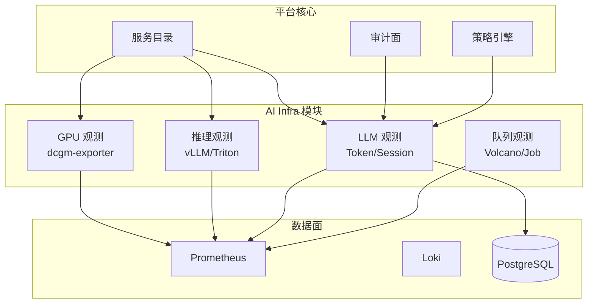
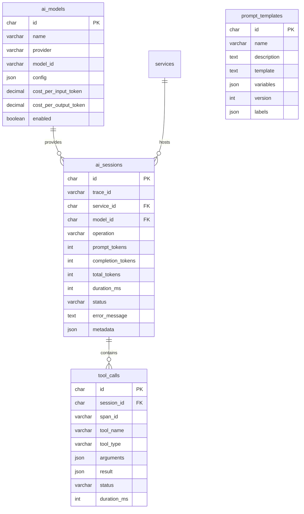
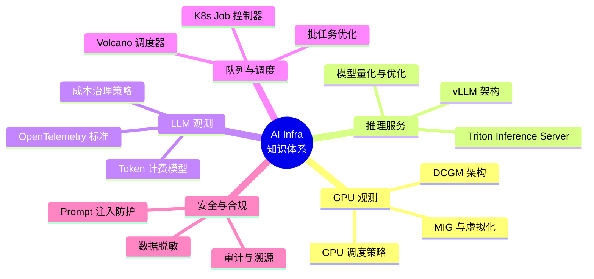
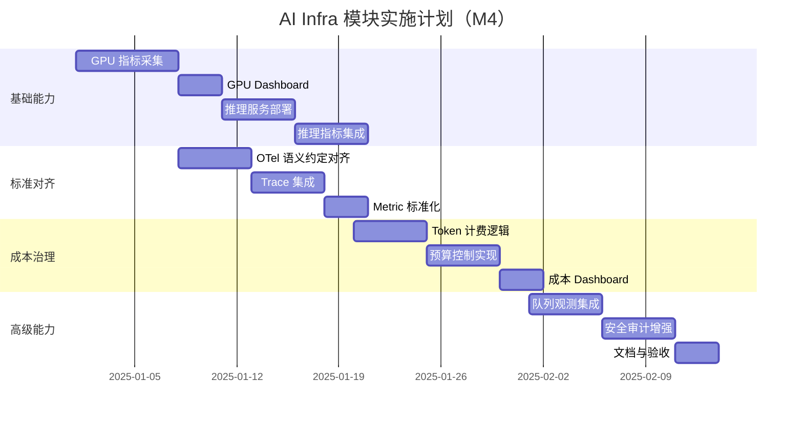
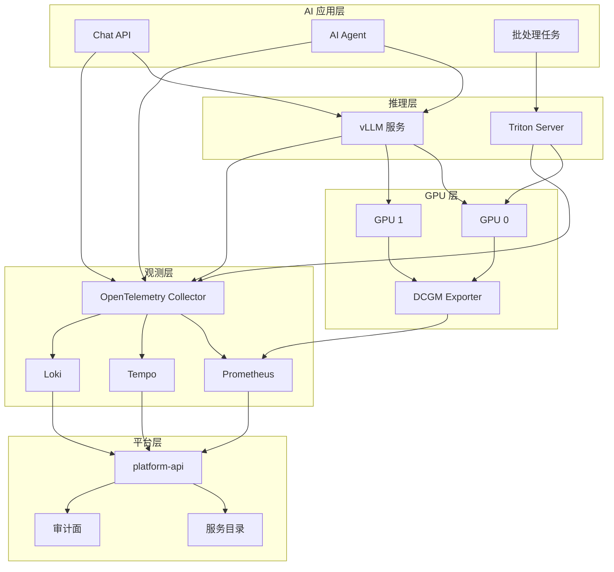

# AI Infra 模块深度分析文档

> 本文档详细分析 cloud-agent-monitor 平台中 AI Infra 模块的当前设计、行业标准对比、差距分析以及学习路径。

---

## 目录

1. [模块定位与价值](#1-模块定位与价值)
2. [当前设计详解](#2-当前设计详解)
3. [行业标准与最佳实践](#3-行业标准与最佳实践)
4. [差距分析](#4-差距分析)
5. [学习路径与资源](#5-学习路径与资源)
6. [实施建议](#6-实施建议)

---

## 1. 模块定位与价值

### 1.1 核心定位

AI Infra 模块是观测平台在 **阶段③** 的核心能力扩展，旨在为 AI/ML 工作负载提供**统一的观测能力**，解决以下关键问题：

| 问题域 | 具体痛点 | AI Infra 的解决方案 |
|--------|----------|---------------------|
| **GPU 资源可见性** | GPU 利用率、显存、温度等指标分散，难以关联业务 | 统一采集 dcgm-exporter 指标，纳入服务目录标签规范 |
| **推理性能追踪** | TTFT、TPOT、吞吐量等关键指标缺乏标准化定义 | 定义 AI 专用 SLI/SLO，与业务指标联动 |
| **成本治理** | Token 消耗、模型调用成本难以量化 | Token 级别记账，预算控制，成本归因 |
| **模型行为审计** | LLM 调用链路不透明，工具调用难以追踪 | 完整 session 追踪，tool call 记录，审计日志 |
| **队列与调度** | 批任务排队、调度延迟影响业务 | 队列深度、调度延迟指标，与 GPU 指标关联 |

### 1.2 与整体架构的关系



**关键集成点**：
- **服务目录**：AI 模型、推理服务作为一等公民纳入目录，与业务服务同一套标签规范
- **审计面**：LLM 调用、工具调用记录审计日志，支持合规与安全分析
- **策略引擎**：Token 预算、模型访问控制、速率限制

---

## 2. 当前设计详解

### 2.1 数据模型设计

当前已实现的数据库 Schema（[002_ai_observability.up.sql](../internal/storage/migrations/postgresql/002_ai_observability.up.sql)）：



**设计亮点**：
1. **模型成本模型**：`cost_per_input_token` / `cost_per_output_token` 支持精细化成本核算
2. **Session 追踪**：`trace_id` 与 OpenTelemetry 集成，支持分布式追踪
3. **工具调用记录**：`tool_calls` 表完整记录 Agent 工具调用链路
4. **Prompt 模板管理**：版本化、标签化管理，支持 A/B 测试

### 2.2 代码结构

```
internal/aiinfra/
├── application/           # 应用层
│   ├── dto.go            # 数据传输对象
│   └── service.go        # 应用服务
├── domain/               # 领域层
│   ├── model.go          # 领域模型
│   ├── semconv.go        # 语义约定（OpenTelemetry）
│   ├── repository.go     # 仓储接口
│   ├── service.go        # 领域服务
│   └── errors.go         # 领域错误
├── infrastructure/       # 基础设施层
│   ├── collector.go      # 指标采集器
│   ├── metrics.go        # Prometheus 指标定义
│   └── repository.go     # 仓储实现
└── interfaces/           # 接口层
    └── http/
        ├── handler.go    # HTTP 处理器
        └── routes.go     # 路由定义
```

**分层职责**：
- **Domain**：定义 AI 观测的核心概念（Session、ToolCall、Model）和语义约定
- **Application**：编排用例，如 Session 创建、Token 计费、成本统计
- **Infrastructure**：对接 Prometheus（指标）、PostgreSQL（元数据）、OpenTelemetry（追踪）
- **Interfaces**：暴露 HTTP API 供外部查询

### 2.3 已规划的能力

根据 [观测性平台计划.md](./观测性平台计划.md) 的 M4 里程碑：

| 能力 | 状态 | 说明 |
|------|------|------|
| GPU 指标采集 | 规划中 | dcgm-exporter 集成，监控 GPU 利用率、显存、温度、功耗 |
| 推理服务观测 | 规划中 | vLLM / Triton 指标，TTFT、TPOT、吞吐量 |
| LLM Session 追踪 | Schema 已定义 | Token 消耗、延迟、错误率 |
| 工具调用审计 | Schema 已定义 | Agent 工具调用链路记录 |
| 队列与调度观测 | 规划中 | Volcano / K8s Job 队列深度、调度延迟 |
| 成本治理 | Schema 已定义 | Token 级别计费、预算控制 |

---

## 3. 行业标准与最佳实践

### 3.1 OpenTelemetry GenAI Semantic Conventions

**标准来源**：[OpenTelemetry Semantic Conventions v1.37+](https://opentelemetry.io/blog/2025/ai-agent-observability/)

OpenTelemetry 已建立 **GenAI 语义约定**，定义了 LLM 调用的标准化属性：

#### 3.1.1 Span 属性（追踪）

| 属性 | 类型 | 说明 | 示例 |
|------|------|------|------|
| `gen_ai.system` | string | AI 系统标识 | `openai`, `anthropic`, `vertex_ai` |
| `gen_ai.operation.name` | string | 操作类型 | `chat`, `completion`, `embeddings` |
| `gen_ai.request.model` | string | 请求的模型 | `gpt-4o`, `claude-3-opus` |
| `gen_ai.request.max_tokens` | int | 最大输出 token | `4096` |
| `gen_ai.request.temperature` | float | 温度参数 | `0.7` |
| `gen_ai.usage.input_tokens` | int | 输入 token 数 | `1500` |
| `gen_ai.usage.output_tokens` | int | 输出 token 数 | `800` |
| `gen_ai.response.finish_reasons` | string[] | 完成原因 | `["stop"]` |
| `gen_ai.prompt` | string | 提示词（可选，敏感） | `"Translate..."` |
| `gen_ai.completion` | string | 补全结果（可选，敏感） | `"翻译结果..."` |

#### 3.1.2 Metric 属性（指标）

| 指标名 | 类型 | 单位 | 说明 |
|--------|------|------|------|
| `gen_ai.client.token.usage` | Histogram | `{token}` | Token 使用量 |
| `gen_ai.client.operation.duration` | Histogram | `s` | 操作持续时间 |
| `gen_ai.client.request.duration` | Histogram | `s` | 请求持续时间 |

**最佳实践**：
- 使用 **Histogram** 而非 Counter，支持百分位分析（P50/P95/P99）
- 区分 `operation.duration`（端到端）和 `request.duration`（纯 API 调用）
- 敏感数据（prompt/completion）默认不采集，需显式配置

### 3.2 GPU 观测标准

**标准来源**：[NVIDIA DCGM](https://github.com/NVIDIA/dcgm-exporter)

#### 3.2.1 核心指标

| 指标 | DCGM Field ID | 采集间隔 | 说明 |
|------|---------------|----------|------|
| GPU 利用率 | 1001 (DCGM_FI_DEV_GPU_UTIL) | 1s | 计算单元利用率 |
| 显存利用率 | 1003 (DCGM_FI_DEV_MEM_COPY_UTIL) | 1s | 显存带宽利用率 |
| 显存使用量 | 1004 (DCGM_FI_DEV_FB_FREE) | 1s | 剩余显存 |
| 功耗 | 3005 (DCGM_FI_DEV_POWER_USAGE) | 2s | 实时功耗 |
| 温度 | 3007 (DCGM_FI_DEV_GPU_TEMP) | 5s | GPU 温度 |
| SM 时钟频率 | 1008 (DCGM_FI_DEV_SM_CLOCK) | 1s | 流多处理器时钟 |
| 显存时钟频率 | 1009 (DCGM_FI_DEV_MEM_CLOCK) | 1s | 显存时钟 |
| PCIe 带宽 | 1006 (DCGM_FI_DEV_PCIE_RX_THROUGHPUT) | 1s | PCIe 接收吞吐 |
| XID 错误 | 1501 (DCGM_FI_DEV_XID_ERRORS) | 事件驱动 | NVIDIA XID 错误码 |

#### 3.2.2 标签规范

```promql
# 推荐标签
DCGM_FI_DEV_GPU_UTIL{
    gpu="0",                    # GPU 索引
    modelName="NVIDIA_A100",    # GPU 型号
    UUID="GPU-xxx",             # GPU UUID
    namespace="llm-inference",  # K8s namespace
    pod="vllm-xxx",             # 关联的 Pod
    service="chat-api"          # 业务服务
}
```

**最佳实践**：
- 通过 **Node Exporter** 关联 GPU 与 K8s Node
- 使用 **MIG (Multi-Instance GPU)** 时，增加 `mig_profile` 标签
- 监控 **XID 错误**，及时发现硬件故障

### 3.3 LLM 推理性能指标

**标准来源**：[vLLM Metrics](https://docs.vllm.ai/en/latest/serving/metrics.html), [Triton Metrics](https://github.com/triton-inference-server/server/blob/main/docs/user_guide/metrics.md)

#### 3.3.1 关键性能指标

| 指标 | 说明 | 目标值 | 告警阈值 |
|------|------|--------|----------|
| **TTFT** (Time to First Token) | 首个 Token 延迟 | < 500ms (P95) | > 2s |
| **TPOT** (Time Per Output Token) | 每个 Token 生成时间 | < 50ms | > 100ms |
| **Throughput** | 吞吐量 (tokens/s) | 根据业务需求 | 下降 > 30% |
| **Queue Length** | 请求队列长度 | < 10 | > 50 |
| **KV Cache Usage** | KV 缓存利用率 | < 80% | > 95% |
| **Request Success Rate** | 请求成功率 | > 99.9% | < 99% |

#### 3.3.2 vLLM 指标示例

```promql
# vLLM 内置指标
vllm:num_requests_running{}           # 正在运行的请求数
vllm:num_requests_waiting{}           # 等待队列长度
vllm:gpu_cache_usage_perc{}           # GPU 缓存利用率
vllm:time_to_first_token_seconds{}    # TTFT 直方图
vllm:time_per_output_token_seconds{}  # TPOT 直方图
vllm:e2e_request_latency_seconds{}    # 端到端延迟
```

### 3.4 成本治理最佳实践

**参考来源**：[Datadog LLM Observability](https://www.datadoghq.com/blog/llm-otel-semantic-convention/), [AWS Agentic AI Guidance](https://docs.aws.amazon.com/prescriptive-guidance/latest/agentic-ai-serverless/observability-and-monitoring.html)

#### 3.4.1 Token 级别记账

```go
type TokenUsage struct {
    ModelID          string    `json:"model_id"`
    Operation        string    `json:"operation"`        // chat, completion, embeddings
    PromptTokens     int       `json:"prompt_tokens"`
    CompletionTokens int       `json:"completion_tokens"`
    TotalTokens      int       `json:"total_tokens"`
    CostUSD          float64   `json:"cost_usd"`
    Timestamp        time.Time `json:"timestamp"`
    
    // 归因标签
    ServiceID        string    `json:"service_id"`       // 业务服务
    UserID           string    `json:"user_id"`          // 用户/租户
    SessionID        string    `json:"session_id"`       // 会话 ID
}
```

#### 3.4.2 预算控制策略

```yaml
# 预算配置示例
budgets:
  - name: "daily-llm-budget"
    scope:
      service: "chat-api"
      model: "gpt-4o"
    limits:
      daily_tokens: 1_000_000
      daily_cost_usd: 100
    actions:
      - threshold: 80%
        action: "alert"
      - threshold: 100%
        action: "throttle"  # 降级到更便宜的模型
```

---

## 4. 差距分析

### 4.1 当前设计与行业标准的对比

| 维度 | 当前设计 | 行业标准 | 差距 | 优先级 |
|------|----------|----------|------|--------|
| **语义约定** | 自定义字段 | OpenTelemetry GenAI Semantic Conventions | 未遵循 OTel 标准，难以与生态集成 | **高** |
| **GPU 指标** | 未实现 | DCGM Exporter + 标准标签 | 缺失 GPU 观测能力 | **高** |
| **推理指标** | 未实现 | vLLM/Triton 内置指标 | 缺失 TTFT/TPOT 等关键指标 | **高** |
| **Token 追踪** | Schema 已定义 | OTel Span + Metric | 缺少与 Trace 的集成 | **中** |
| **成本治理** | Schema 已定义 | 预算控制 + 降级策略 | 缺少实时预算控制逻辑 | **中** |
| **队列观测** | 未规划 | Volcano / K8s Job 指标 | 缺失批任务观测 | **低** |
| **多模态** | 未规划 | 图像/音频 Token 计费 | 仅支持文本 Token | **低** |

### 4.2 关键差距详解

#### 4.2.1 语义约定差距

**当前问题**：
- `ai_sessions` 表的字段命名与 OTel 标准不一致
- 缺少 `gen_ai.system`、`gen_ai.operation.name` 等标准属性
- 无法与 Datadog、Grafana Tempo 等工具无缝集成

**改进建议**：
```sql
-- 增加 OTel 标准字段
ALTER TABLE ai_sessions ADD COLUMN gen_ai_system VARCHAR(50);
ALTER TABLE ai_sessions ADD COLUMN gen_ai_operation VARCHAR(50);
ALTER TABLE ai_sessions ADD COLUMN span_id VARCHAR(64);
ALTER TABLE ai_sessions ADD COLUMN parent_span_id VARCHAR(64);

-- 创建索引
CREATE INDEX idx_ai_sessions_span ON ai_sessions(span_id);
```

#### 4.2.2 GPU 观测差距

**当前问题**：
- 完全缺失 GPU 指标采集
- 无法监控 GPU 利用率、显存、温度
- 无法关联 GPU 与推理服务

**改进建议**：
1. 部署 **dcgm-exporter**，采集 GPU 指标到 Prometheus
2. 在服务目录中增加 `gpu_model`、`gpu_count` 属性
3. 创建 GPU 专用 Dashboard 和告警规则

#### 4.2.3 推理性能差距

**当前问题**：
- 缺少 TTFT、TPOT 等关键性能指标
- 无法区分推理延迟的瓶颈（模型 vs 网络 vs 队列）
- 缺少 KV Cache 监控

**改进建议**：
1. 集成 vLLM/Triton 内置指标
2. 定义 AI 专用 SLI/SLO
3. 创建推理性能 Dashboard

#### 4.2.4 MFU 指标观测缺失 ⚠️ **高优先级**

**背景**：MFU (Model FLOPS Utilization) 是衡量 GPU 计算效率的核心指标，表示实际达到的 FLOPS 与理论峰值 FLOPS 的比率。这是 AI 训练/推理中最关键的性能指标之一。

**当前问题**：
- `GPUMetric` 结构体仅有 `GPUUtilization`，缺少 MFU 相关字段
- 无法区分"GPU 利用率高但计算效率低"的情况
- 无法识别 kernel launch overhead、内存带宽瓶颈等问题
- 无法评估模型优化（如 FlashAttention、量化）的真实效果

**影响分析**：
```
GPU 利用率 90% ≠ 计算效率高
实际场景：GPU 利用率 90%，但 MFU 可能只有 30%
原因：kernel launch overhead、内存带宽瓶颈、小 batch 效率低
```

**MFU 计算公式**：
```
MFU = (实际 FLOPS) / (理论峰值 FLOPS) × 100%

实际 FLOPS = (Token 数 × 每Token FLOPs) / 训练/推理时间
每Token FLOPs ≈ 6 × 参数量 (训练) 或 2 × 参数量 (推理)
```

**缺失的 MFU 相关指标**：

| 指标 | 说明 | 数据来源 |
|------|------|----------|
| **Achieved TFLOPS** | 实际达到的 TFLOPS | DCGM + 理论峰值计算 |
| **Theoretical TFLOPS** | 理论峰值 TFLOPS | GPU 型号规格表 |
| **MFU** | Achieved / Theoretical | 计算得出 |
| **Tensor Core Utilization** | Tensor Core 利用率 | Nsight Compute / DCGM |
| **SM Efficiency** | 流多处理器效率 | Nsight Compute |
| **Memory Bandwidth Utilization** | 显存带宽利用率 | DCGM |

**改进建议**：
```sql
-- 扩展 gpu_metrics 表
ALTER TABLE gpu_metrics ADD COLUMN mfu_percent DECIMAL(5,2) COMMENT 'MFU 百分比';
ALTER TABLE gpu_metrics ADD COLUMN achieved_tflops DECIMAL(10,2) COMMENT '实际达到的 TFLOPS';
ALTER TABLE gpu_metrics ADD COLUMN tensor_core_util DECIMAL(5,2) COMMENT 'Tensor Core 利用率';
ALTER TABLE gpu_metrics ADD COLUMN sm_efficiency DECIMAL(5,2) COMMENT 'SM 效率';
ALTER TABLE gpu_metrics ADD COLUMN memory_bw_util DECIMAL(5,2) COMMENT '显存带宽利用率';
```

```go
// MFU 计算器实现
type MFUCalculator struct {
    gpuSpecs map[string]*GPUSpec
}

type GPUSpec struct {
    Model           string
    TheoreticalFP16 float64  // FP16 TFLOPS
    TheoreticalBF16 float64  // BF16 TFLOPS
    TheoreticalFP8  float64  // FP8 TFLOPS
    MemoryBWGBps    float64  // 显存带宽 GB/s
}

func (c *MFUCalculator) CalculateMFU(
    gpuModel string,
    tokensGenerated int,
    modelParams int64,
    durationSeconds float64,
    precision string,
) float64 {
    spec := c.gpuSpecs[gpuModel]
    achievedFLOPS := float64(tokensGenerated * 2 * modelParams) / durationSeconds
    var theoreticalFLOPS float64
    switch precision {
    case "fp16":
        theoreticalFLOPS = spec.TheoreticalFP16 * 1e12
    case "bf16":
        theoreticalFLOPS = spec.TheoreticalBF16 * 1e12
    }
    return (achievedFLOPS / theoreticalFLOPS) * 100
}
```

#### 4.2.5 GPU 指标与推理服务关联不足

**当前问题**：
- `gpu_nodes` 表通过 `k8s_pod_name` 关联，但缺少 `inference_service_id` 直接关联
- 无法直接查询"某推理服务的 GPU MFU"
- 缺少服务级别的 GPU 效率归因

**改进建议**：
```sql
ALTER TABLE gpu_nodes ADD COLUMN inference_service_id CHAR(36) 
    COMMENT '关联的推理服务 ID';
ALTER TABLE inference_requests ADD COLUMN mfu_percent DECIMAL(5,2) 
    COMMENT '请求期间的 MFU';
```

#### 4.2.6 推理服务性能归因不完整

**当前问题**：
- `inference_requests` 表有 `ttft_ms`、`tpot_ms`，但缺少细粒度阶段分解
- 无法区分 prefill 阶段和 decode 阶段的性能瓶颈

**缺失的指标**：

| 指标 | 说明 | 重要性 |
|------|------|--------|
| `prefill_time_ms` | 预填充阶段时间 | 高 |
| `decode_time_ms` | 解码阶段时间 | 高 |
| `kv_cache_hit_rate` | KV 缓存命中率 | 高 |
| `batch_efficiency` | 批处理效率 | 中 |
| `queue_wait_ratio` | 队列等待时间占比 | 中 |

**改进建议**：
```sql
ALTER TABLE inference_requests ADD COLUMN prefill_time_ms INT 
    COMMENT 'Prefill 阶段时间';
ALTER TABLE inference_requests ADD COLUMN decode_time_ms INT 
    COMMENT 'Decode 阶段时间';
ALTER TABLE inference_requests ADD COLUMN kv_cache_hit_rate DECIMAL(5,2) 
    COMMENT 'KV 缓存命中率';
ALTER TABLE inference_requests ADD COLUMN batch_efficiency DECIMAL(5,2) 
    COMMENT '批处理效率';
```

#### 4.2.7 观测系统性能开销控制缺失

**当前问题**：
- 观测系统本身可能成为性能瓶颈
- 没有采样率动态调整机制
- 没有开销预算控制
- 高基数指标可能导致 Prometheus 压力过大

**影响**：
- 观测系统占用过多 CPU/内存，影响业务性能
- 数据量爆炸导致存储成本失控

**改进建议**：参见 [innovation-roadmap.md](./innovation-roadmap.md) 中的"观测系统开销优化"章节。

### 4.3 技术债务清单

| 债务项 | 影响 | 偿还成本 | 建议时间 |
|--------|------|----------|----------|
| **MFU 指标观测** | 无法评估真实计算效率 | 3-5 人日 | **M4 初期** |
| **GPU-服务关联** | 无法归因 GPU 效率到服务 | 1-2 人日 | M4 初期 |
| OTel 语义约定对齐 | 与生态集成困难 | 2-3 人日 | M4 初期 |
| GPU 指标采集 | 缺失核心能力 | 3-5 人日 | M4 初期 |
| 推理指标集成 | 性能盲区 | 2-3 人日 | M4 中期 |
| **推理阶段分解** | 无法定位 prefill/decode 瓶颈 | 2-3 人日 | M4 中期 |
| 成本控制逻辑 | 预算超支风险 | 3-5 人日 | M4 中期 |
| **观测开销控制** | 观测系统可能成为瓶颈 | 3-5 人日 | M4 中期 |
| 队列观测 | 批任务盲区 | 2-3 人日 | M4 后期 |

---

## 5. 学习路径与资源

### 5.1 核心知识领域



### 5.2 推荐学习路径

#### 阶段 1：基础能力（2-3 周）

**目标**：掌握 GPU 观测和推理服务基础

| 学习内容 | 资源 | 实践任务 |
|----------|------|----------|
| **DCGM 基础** | [NVIDIA DCGM Documentation](https://docs.nvidia.com/datacenter/dcgm/latest/user-guide/index.html) | 部署 dcgm-exporter，采集 GPU 指标 |
| **Prometheus GPU 监控** | [GPU Monitoring with Prometheus](https://github.com/NVIDIA/dcgm-exporter) | 创建 GPU Dashboard |
| **vLLM 基础** | [vLLM Documentation](https://docs.vllm.ai/) | 部署 vLLM 服务，暴露指标 |
| **推理性能指标** | [LLM Performance Metrics](https://blog.csdn.net/YPeng_Gao/article/details/148364168) | 理解 TTFT/TPOT 定义 |

**实践项目**：
```bash
# 1. 部署 dcgm-exporter
docker run -d --gpus all --name dcgm-exporter \
  -p 9400:9400 \
  nvcr.io/nvidia/k8s/dcgm-exporter:3.3.0-3.1.1-ubuntu20.04

# 2. 配置 Prometheus 采集
scrape_configs:
  - job_name: 'dcgm'
    static_configs:
      - targets: ['dcgm-exporter:9400']

# 3. 部署 vLLM
python -m vllm.entrypoints.openai.api_server \
  --model meta-llama/Llama-2-7b-chat-hf \
  --port 8000
```

#### 阶段 2：标准与集成（2-3 周）

**目标**：掌握 OpenTelemetry 标准和集成方法

| 学习内容 | 资源 | 实践任务 |
|----------|------|----------|
| **OTel Semantic Conventions** | [OpenTelemetry GenAI Conventions](https://opentelemetry.io/blog/2025/ai-agent-observability/) | 理解标准属性定义 |
| **OTel SDK 集成** | [OpenTelemetry Go SDK](https://opentelemetry.io/docs/languages/go/) | 为 LLM 调用添加 Trace |
| **Datadog LLM Observability** | [Datadog LLM Observability](https://www.datadoghq.com/blog/llm-otel-semantic-convention/) | 学习行业最佳实践 |
| **Token 计费模型** | [LLM Cost Tracking](https://www.getmaxim.ai/articles/monitoring-latency-and-cost-in-llm-operations-essential-metrics-for-success/) | 设计成本核算逻辑 |

**实践项目**：
```go
// 为 LLM 调用添加 OTel Trace
func CallLLM(ctx context.Context, prompt string) (string, error) {
    tracer := otel.Tracer("llm-client")
    ctx, span := tracer.Start(ctx, "llm.chat",
        trace.WithAttributes(
            attribute.String("gen_ai.system", "openai"),
            attribute.String("gen_ai.operation.name", "chat"),
            attribute.String("gen_ai.request.model", "gpt-4o"),
        ),
    )
    defer span.End()
    
    start := time.Now()
    response, err := openaiClient.Chat(ctx, prompt)
    duration := time.Since(start)
    
    span.SetAttributes(
        attribute.Int("gen_ai.usage.input_tokens", response.Usage.PromptTokens),
        attribute.Int("gen_ai.usage.output_tokens", response.Usage.CompletionTokens),
        attribute.Float64("gen_ai.client.operation.duration", duration.Seconds()),
    )
    
    return response.Text, err
}
```

#### 阶段 3：高级能力（3-4 周）

**目标**：掌握队列调度、成本治理、安全合规

| 学习内容 | 资源 | 实践任务 |
|----------|------|----------|
| **Volcano 调度器** | [Volcano Documentation](https://volcano.sh/en/docs/) | 部署 Volcano，监控队列 |
| **K8s Job 控制器** | [Kubernetes Jobs](https://kubernetes.io/docs/concepts/workloads/controllers/job/) | 创建批任务，监控状态 |
| **成本治理** | [FinOps for AI](https://www.truefoundry.com/blog/what-is-llm-observability) | 实现预算控制逻辑 |
| **Prompt 安全** | [OWASP LLM Top 10](https://owasp.org/www-project-top-10-for-large-language-model-applications/) | 实现 Prompt 注入防护 |

### 5.3 推荐资源清单

#### 官方文档

| 资源 | 链接 | 说明 |
|------|------|------|
| OpenTelemetry GenAI Semantic Conventions | https://opentelemetry.io/blog/2025/ai-agent-observability/ | AI 观测标准 |
| NVIDIA DCGM Documentation | https://docs.nvidia.com/datacenter/dcgm/latest/user-guide/ | GPU 监控标准 |
| vLLM Documentation | https://docs.vllm.ai/ | 推理服务文档 |
| Triton Inference Server | https://github.com/triton-inference-server/server | 推理服务文档 |
| Volcano Documentation | https://volcano.sh/en/docs/ | 批任务调度器 |

#### 行业博客

| 资源 | 链接 | 说明 |
|------|------|------|
| Datadog LLM Observability | https://www.datadoghq.com/blog/llm-otel-semantic-convention/ | 行业最佳实践 |
| AWS Agentic AI Guidance | https://docs.aws.amazon.com/prescriptive-guidance/latest/agentic-ai-serverless/ | 云厂商实践 |
| LLM Observability Best Practices | https://www.getmaxim.ai/articles/llm-observability-best-practices-for-2025/ | 2025 最佳实践 |
| GPU Observability Guide | https://techstrong.ai/social-facebook/best-practices-for-gpu-observability-in-modern-ai-infrastructure/ | GPU 观测指南 |

#### 开源项目

| 项目 | 链接 | 说明 |
|------|------|------|
| dcgm-exporter | https://github.com/NVIDIA/dcgm-exporter | GPU 指标导出器 |
| vLLM | https://github.com/vllm-project/vllm | 高性能推理引擎 |
| OpenLLMetry | https://github.com/traceloop/openllmetry | LLM OTel 集成库 |
| Langfuse | https://github.com/langfuse/langfuse | LLM 观测平台（开源） |

### 5.4 认证与课程

| 认证/课程 | 提供方 | 说明 |
|-----------|--------|------|
| NVIDIA Deep Learning Institute | NVIDIA | GPU 编程与优化 |
| OpenTelemetry Certified Associate | CNCF | OTel 标准认证 |
| Kubernetes Certified Application Developer | CNCF | K8s 应用开发 |
| FinOps Certified Practitioner | FinOps Foundation | 云成本管理 |

---

## 6. 实施建议

### 6.1 M4 里程碑详细规划



### 6.2 验收标准

| 验收项 | 标准 | 验证方法 |
|--------|------|----------|
| **GPU 观测** | 能区分算力/调度/应用层瓶颈 | 注入 GPU 故障，15 分钟内定位 |
| **推理性能** | TTFT P95 < 500ms，TPOT P95 < 50ms | 压测验证 |
| **成本治理** | 预算超支自动告警，支持降级 | 模拟超支场景 |
| **标准对齐** | OTel Trace 可在 Grafana Tempo 中查询 | 端到端验证 |
| **审计合规** | 所有 LLM 调用可溯源 | 审计查询验证 |

### 6.3 风险与缓解

| 风险 | 影响 | 缓解措施 |
|------|------|----------|
| GPU 资源不足 | 无法实践 GPU 观测 | 使用云 GPU 或 Colab |
| OTel 标准变化 | 需要重构 | 关注 OTel 社区动态，预留适配层 |
| 成本控制逻辑复杂 | 开发周期延长 | 先实现基础功能，迭代优化 |
| 安全合规要求高 | 延迟上线 | 早期引入安全评审 |

### 6.4 后续演进方向

1. **多模态观测**：支持图像、音频 Token 计费
2. **模型路由优化**：基于成本/性能自动选择模型
3. **智能采样**：基于异常检测动态调整采样率
4. **FinOps 集成**：与云成本平台联动

---

## 附录

### A. 关键指标字典

#### GPU 指标

| 指标名 | PromQL | 说明 |
|--------|--------|------|
| GPU 利用率 | `DCGM_FI_DEV_GPU_UTIL` | 计算单元利用率 (%) |
| 显存使用率 | `1 - (DCGM_FI_DEV_FB_FREE / DCGM_FI_DEV_FB_USED)` | 显存使用率 (%) |
| GPU 功耗 | `DCGM_FI_DEV_POWER_USAGE` | 实时功耗 (W) |
| GPU 温度 | `DCGM_FI_DEV_GPU_TEMP` | GPU 温度 (°C) |
| **MFU** | `achieved_tflops / theoretical_tflops * 100` | **模型 FLOPS 利用率 (%)** |
| **Tensor Core 利用率** | `DCGM_FI_DEV_TENSOR_CORE_UTIL` | **Tensor Core 利用率 (%)** |
| **显存带宽利用率** | `DCGM_FI_DEV_MEM_COPY_UTIL` | **显存带宽利用率 (%)** |

#### 推理指标

| 指标名 | PromQL | 说明 |
|--------|--------|------|
| TTFT P95 | `histogram_quantile(0.95, vllm:time_to_first_token_seconds_bucket)` | 首 Token 延迟 |
| TPOT P95 | `histogram_quantile(0.95, vllm:time_per_output_token_seconds_bucket)` | 每 Token 延迟 |
| 请求队列长度 | `vllm:num_requests_waiting` | 等待队列长度 |
| KV Cache 利用率 | `vllm:gpu_cache_usage_perc` | GPU 缓存利用率 (%) |

#### LLM 指标

| 指标名 | PromQL | 说明 |
|--------|--------|------|
| Token 消耗速率 | `rate(gen_ai_client_token_usage_total[5m])` | Token 消耗速率 |
| 请求成功率 | `sum(rate(gen_ai_requests_total{status="success"}[5m])) / sum(rate(gen_ai_requests_total[5m]))` | 请求成功率 |
| 平均延迟 | `rate(gen_ai_client_operation_duration_seconds_sum[5m]) / rate(gen_ai_client_operation_duration_seconds_count[5m])` | 平均延迟 (s) |

### B. 参考架构图



---

**文档版本**：v1.1  
**最后更新**：2026-04-10  
**维护者**：cloud-agent-monitor 团队

**变更记录**：
- v1.1 (2026-04-10): 新增 MFU 指标观测缺失分析、GPU-服务关联不足、推理阶段分解、观测系统开销控制等设计缺陷分析
- v1.0 (2025-04-03): 初版
