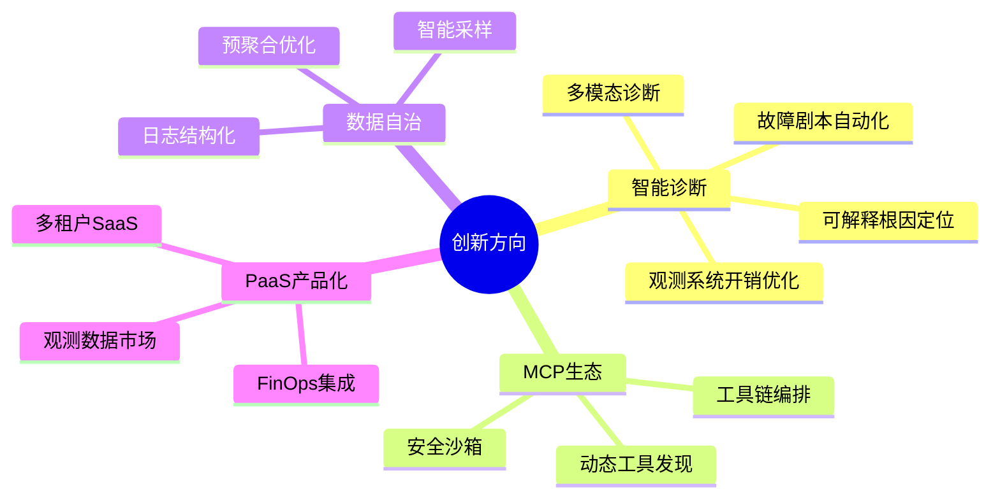

# 创新路线图（Innovation Roadmap）

本文档详细描述 cloud-agent-monitor 平台在 MVP 基础上的**差异化创新方向**，包括技术实现路径、里程碑定义和预期价值。这些创新基于现有架构（MCP + Eino + 服务目录）自然延伸，形成技术壁垒和竞争护城河。

---

## 1. 创新领域总览



---

## 2. 智能诊断编排创新

### 2.1 故障剧本自动化（Runbook Automation）

**背景**：传统 SRE 面对告警时，需要手动执行一系列排查步骤，耗时且容易遗漏。

**创新方案**：
```yaml
# 故障剧本示例：数据库慢查询诊断
runbook:
  name: "db_slow_query_diagnosis"
  trigger:
    alert: "PostgreSQLQueryLatencyHigh"
    threshold: "p99 > 100ms"
  
  steps:
    - name: "fetch_slow_queries"
      tool: "postgres.top_queries"
      params:
        order_by: "mean_time"
        limit: 10
    
    - name: "analyze_query_plan"
      tool: "postgres.explain"
      condition: "step.fetch_slow_queries.count > 0"
      iterate: "{{ step.fetch_slow_queries.items }}"
    
    - name: "check_missing_indexes"
      tool: "postgres.missing_indexes"
      condition: "step.analyze_query_plan.seq_scan_ratio > 0.5"
    
    - name: "generate_recommendation"
      llm:
        model: "deepseek-chat"
        prompt: |
          基于以下诊断结果生成优化建议：
          慢查询: {{ step.fetch_slow_queries.summary }}
          执行计划: {{ step.analyze_query_plan.details }}
          索引建议: {{ step.check_missing_indexes.recommendations }}
  
  output:
    format: "markdown"
    recipients: ["oncall-sre"]
    auto_create_ticket: true
```

**技术实现**：
- 使用 **Eino DAG** 编排步骤依赖
- 状态机持久化到 PostgreSQL，支持断点续作
- MCP 工具调用作为 DAG 节点
- LLM 用于最后一步建议生成（可解释性输出）

**预期价值**：
- 值班响应时间从 30 分钟降至 5 分钟
- 减少人为遗漏排查步骤
- 沉淀可复用的诊断知识

---

### 2.2 多模态诊断

**背景**：复杂故障往往涉及指标异常、日志错误、Trace 延迟等多个信号，人工关联困难。

**创新方案**：

```python
# 多模态诊断流程示意
class MultimodalDiagnosis:
    def analyze(self, incident_context):
        # 1. 多模态数据编码
        metric_embedding = self.metric_encoder.encode(
            incident_context.metric_anomaly_window
        )
        log_embedding = self.log_encoder.encode(
            incident_context.error_logs
        )
        trace_embedding = self.trace_encoder.encode(
            incident_context.slow_traces
        )
        
        # 2. 跨模态注意力融合
        fused_representation = self.cross_modal_attention(
            [metric_embedding, log_embedding, trace_embedding]
        )
        
        # 3. 根因分类
        root_cause = self.classifier.predict(fused_representation)
        
        # 4. 生成可解释报告
        explanation = self.explainer.generate(
            root_cause, 
            attention_weights=self.cross_modal_attention.weights
        )
        
        return DiagnosisResult(
            root_cause=root_cause,
            confidence=explanation.confidence,
            evidence=explanation.highlighted_evidence,
            recommended_actions=explanation.actions
        )
```

**技术实现**：
- 指标编码：时间序列异常检测模型（如 Anomaly Transformer）
- 日志编码：LogBERT 或类似预训练模型
- Trace 编码：图神经网络（GNN）处理调用链拓扑
- 跨模态融合：多头注意力机制
- Eino 编排整体流程

**预期价值**：
- 复杂故障定位准确率提升 40%
- 减少跨团队信息同步成本
- 积累可复用的多模态诊断模型

---

### 2.3 可解释根因定位

**背景**：AI 给出的诊断结论如果缺乏解释，用户难以信任，也无法审计。

**创新方案**：

```go
// Eino 可解释推理示例
package advisor

import (
    "github.com/cloudwego/eino/components/chain"
    "github.com/cloudwego/eino/components/prompt"
)

type ExplainableDiagnosis struct {
    Conclusion    string            `json:"conclusion"`     // 最终结论
    Confidence    float64           `json:"confidence"`     // 置信度
    ReasoningPath []ReasoningStep   `json:"reasoning_path"` // 推理路径
    Evidence      []EvidenceItem    `json:"evidence"`       // 证据列表
}

type ReasoningStep struct {
    StepNumber  int    `json:"step_number"`
    Description string `json:"description"`
    Input       string `json:"input"`
    Output      string `json:"output"`
    ToolUsed    string `json:"tool_used,omitempty"`
}

func BuildExplainableChain() chain.Chain {
    // 1. 构建推理步骤（Chain-of-Thought）
    steps := []chain.Step{
        {
            Name: "gather_evidence",
            Prompt: prompt.New(
                "基于告警 {{.alert_name}}，从以下数据源收集证据：\n" +
                "1. 查询相关指标趋势\n" +
                "2. 检索相关错误日志\n" +
                "3. 分析服务依赖拓扑\n",
            ),
            // 调用 MCP 工具收集证据
        },
        {
            Name: "analyze_patterns",
            Prompt: prompt.New(
                "基于收集的证据：\n{{.evidence}}\n\n" +
                "分析是否符合已知故障模式：\n" +
                "- 资源耗尽型\n" +
                "- 依赖故障型\n" +
                "- 配置变更型\n" +
                "- 流量突增型\n",
            ),
        },
        {
            Name: "generate_conclusion",
            Prompt: prompt.New(
                "基于以上分析，生成最终诊断结论：\n" +
                "1. 根因定位\n" +
                "2. 置信度评估（0-1）\n" +
                "3. 推荐修复操作\n" +
                "4. 验证修复效果的方法\n",
            ),
        },
    }
    
    return chain.NewChain(steps...)
}

// 生成可解释报告
func GenerateExplanation(result *ExplainableDiagnosis) string {
    report := fmt.Sprintf(`
# 诊断报告

## 结论
%s

## 置信度
%.2f%%

## 推理过程
`, result.Conclusion, result.Confidence*100)
    
    for _, step := range result.ReasoningPath {
        report += fmt.Sprintf(`
### 步骤 %d: %s
- 输入: %s
- 输出: %s
- 使用工具: %s
`, step.StepNumber, step.Description, step.Input, step.Output, step.ToolUsed)
    }
    
    report += "\n## 证据列表\n"
    for _, evidence := range result.Evidence {
        report += fmt.Sprintf("- %s: %s\n", evidence.Type, evidence.Summary)
    }
    
    return report
}
```

**技术实现**：
- 使用 Eino 的 Chain-of-Thought 编排推理步骤
- 每个步骤记录输入、输出、使用的工具
- LLM 用于生成最终结论和置信度评估
- 输出 Markdown 格式的可解释报告

**预期价值**：
- 增强用户对 AI 诊断的信任
- 支持审计和合规要求
- 便于知识沉淀和复盘

---

### 2.4 观测系统开销优化

**背景**：观测性平台对于性能占用预计会极其苛刻，观测系统本身可能成为性能瓶颈。当前系统缺少开销预算控制机制。

**问题分析**：
- 观测系统占用过多 CPU/内存，影响业务性能
- 高基数指标可能导致 Prometheus 压力过大
- 数据量爆炸导致存储成本失控
- 没有采样率动态调整机制

**创新方案**：

#### 2.4.1 自适应采样策略

```go
package observability

import (
    "context"
    "math/rand"
    "time"
)

type SamplingStrategy struct {
    BaseRate         float64  // 基础采样率 (如 1%)
    AnomalyBoostRate float64  // 异常时提升采样率 (如 100%)
    MaxOverheadPct   float64  // 最大开销百分比 (如 2%)
    
    metricsCollector *MetricsCollector
    anomalyDetector  *AnomalyDetector
}

type SamplingConfig struct {
    Metrics SamplingTierConfig `yaml:"metrics"`
    Traces  SamplingTierConfig `yaml:"traces"`
    Logs    SamplingTierConfig `yaml:"logs"`
}

type SamplingTierConfig struct {
    DefaultRate      float64 `yaml:"default_rate"`       // 默认采样率
    HighCardinality  float64 `yaml:"high_cardinality"`   // 高基数指标采样率
    ErrorRate        float64 `yaml:"error_rate"`         // 错误采样率
    AnomalyBoostRate float64 `yaml:"anomaly_boost_rate"` // 异常时提升采样率
}

func (s *SamplingStrategy) ShouldSample(ctx context.Context, metric *Metric) bool {
    // 1. 异常检测触发高采样
    if s.isAnomalyDetected(ctx, metric) {
        return rand.Float64() < s.AnomalyBoostRate
    }
    
    // 2. 错误/异常数据 100% 采样
    if metric.IsError() || metric.IsAnomaly() {
        return true
    }
    
    // 3. 自适应采样率
    rate := s.calculateAdaptiveRate(ctx)
    return rand.Float64() < rate
}

func (s *SamplingStrategy) calculateAdaptiveRate(ctx context.Context) float64 {
    currentOverhead := s.measureOverhead(ctx)
    
    // 开销超限，降低采样率
    if currentOverhead > s.MaxOverheadPct {
        return s.BaseRate * 0.5
    }
    
    // 开销充裕，可适当提高采样率
    if currentOverhead < s.MaxOverheadPct*0.5 {
        return s.BaseRate * 1.5
    }
    
    return s.BaseRate
}

func (s *SamplingStrategy) measureOverhead(ctx context.Context) float64 {
    // 测量观测系统自身的 CPU/内存占用
    return s.metricsCollector.GetSelfOverheadPercent()
}
```

#### 2.4.2 开销预算控制

```yaml
# config.yaml
observability:
  overhead_budget:
    max_cpu_percent: 2        # 最大 CPU 开销百分比
    max_memory_mb: 512        # 最大内存开销 MB
    max_network_mbps: 10      # 最大网络带宽 Mbps
    enforcement_mode: "soft"  # soft=警告, hard=强制降级
    
  sampling:
    metrics:
      default_rate: 0.01          # 1% 采样率
      high_cardinality: 0.001     # 高基数指标 0.1%
      error_rate: 1.0             # 错误指标 100%
    traces:
      default_rate: 0.1           # 10% 采样率
      error_rate: 1.0             # 错误 Trace 100%
      latency_threshold_ms: 500   # 慢请求 100% 采样
    logs:
      error_rate: 1.0             # 错误日志 100%
      warn_rate: 0.5              # 警告日志 50%
      info_rate: 0.01             # Info 日志 1%
      
  cardinality_limits:
    max_label_values_per_metric: 1000
    max_series_per_metric: 10000
    enforcement_action: "drop"    # 超限后丢弃
```

#### 2.4.3 数据降采样与预聚合

```go
package storage

type DownsamplingRule struct {
    SourceResolution time.Duration // 原始分辨率
    TargetResolution time.Duration // 目标分辨率
    AggregationFunc  string        // avg, max, min, sum
    RetentionPeriod  time.Duration // 保留周期
}

var DefaultDownsamplingRules = []DownsamplingRule{
    {time.Minute, 5 * time.Minute, "avg", 30 * 24 * time.Hour},      // 1m -> 5m, 保留 30 天
    {5 * time.Minute, time.Hour, "avg", 90 * 24 * time.Hour},        // 5m -> 1h, 保留 90 天
    {time.Hour, 6 * time.Hour, "avg", 365 * 24 * time.Hour},         // 1h -> 6h, 保留 1 年
}

type PreAggregator struct {
    rules    []DownsamplingRule
    storage  TimeSeriesStorage
    executor *AggregationExecutor
}

func (p *PreAggregator) Aggregate(ctx context.Context, metricName string) error {
    for _, rule := range p.rules {
        // 1. 查询原始数据
        rawData, err := p.storage.Query(ctx, metricName, rule.SourceResolution)
        if err != nil {
            return err
        }
        
        // 2. 执行聚合
        aggregated := p.executor.Aggregate(rawData, rule.AggregationFunc, rule.TargetResolution)
        
        // 3. 写入降采样数据
        if err := p.storage.WriteDownsampled(ctx, metricName, aggregated); err != nil {
            return err
        }
    }
    return nil
}
```

#### 2.4.4 采集器优化

```go
package collector

type OptimizedCollector struct {
    batchSize     int
    flushInterval time.Duration
    buffer        *RingBuffer
    sender        *BatchSender
}

func (c *OptimizedCollector) Collect(metric *Metric) error {
    // 1. 本地预聚合（减少网络传输）
    if aggregated := c.tryLocalAggregate(metric); aggregated != nil {
        metric = aggregated
    }
    
    // 2. 写入环形缓冲区
    c.buffer.Write(metric)
    
    // 3. 批量上报触发条件
    if c.buffer.Size() >= c.batchSize || time.Since(c.lastFlush) > c.flushInterval {
        return c.flush()
    }
    
    return nil
}

func (c *OptimizedCollector) flush() error {
    batch := c.buffer.ReadAll()
    
    // 批量发送，减少网络开销
    if err := c.sender.SendBatch(batch); err != nil {
        // 失败重试 + 本地持久化
        return c.persistForRetry(batch)
    }
    
    c.buffer.Clear()
    c.lastFlush = time.Now()
    return nil
}
```

**技术实现**：
- **自适应采样**：基于异常检测动态调整采样率
- **开销预算**：硬限制观测系统资源占用
- **降采样**：历史数据自动降精度存储
- **批量上报**：减少网络开销

**预期价值**：
- 观测系统 CPU 开销控制在 2% 以内
- 存储成本降低 50% 同时保证关键数据
- 高基数指标自动识别和处理
- 异常时段自动提升采样率，不遗漏关键信息

---

## 3. MCP 工具生态创新

### 3.1 动态工具发现

**背景**：传统 MCP Server 工具是静态定义的，无法适应动态变化的 Agent 生态。

**创新方案**：

```go
// 动态工具注册与发现机制
package mcp

import (
    "context"
    "sync"
    "time"
)

// ToolRegistry 动态工具注册表
type ToolRegistry struct {
    mu          sync.RWMutex
    tools       map[string]*ToolDefinition
    agents      map[string]*AgentInfo
    catalog     *platform.ServiceCatalog
    policy      *PolicyEngine
}

type ToolDefinition struct {
    Name        string                 `json:"name"`
    Description string                 `json:"description"`
    InputSchema map[string]interface{} `json:"inputSchema"`
    Provider    string                 `json:"provider"` // 提供该工具的 Agent/服务
    Capabilities []string              `json:"capabilities"`
    RateLimit   *RateLimitConfig      `json:"rateLimit,omitempty"`
}

type AgentInfo struct {
    ID            string            `json:"id"`
    Name          string            `json:"name"`
    Version       string            `json:"version"`
    Capabilities  []string          `json:"capabilities"`
    RegisteredAt  time.Time         `json:"registered_at"`
    LastHeartbeat time.Time         `json:"last_heartbeat"`
    ToolsProvided []string          `json:"tools_provided"`
}

// RegisterAgent Agent 注册时自动发现并注册其工具
func (r *ToolRegistry) RegisterAgent(ctx context.Context, agent *AgentInfo, tools []*ToolDefinition) error {
    r.mu.Lock()
    defer r.mu.Unlock()
    
    // 1. 验证 Agent 身份和权限
    if err := r.policy.ValidateAgentRegistration(agent); err != nil {
        return fmt.Errorf("agent registration denied: %w", err)
    }
    
    // 2. 注册 Agent
    r.agents[agent.ID] = agent
    
    // 3. 发现并注册工具
    for _, tool := range tools {
        tool.Provider = agent.ID
        
        // 3.1 验证工具合规性
        if err := r.policy.ValidateTool(tool); err != nil {
            log.Printf("Tool %s validation failed: %v", tool.Name, err)
            continue
        }
        
        // 3.2 注册到目录
        if err := r.catalog.RegisterTool(ctx, tool); err != nil {
            return fmt.Errorf("failed to register tool %s: %w", tool.Name, err)
        }
        
        r.tools[tool.Name] = tool
        agent.ToolsProvided = append(agent.ToolsProvided, tool.Name)
        
        log.Printf("Tool %s registered by agent %s", tool.Name, agent.ID)
    }
    
    // 4. 审计记录
    r.audit.Record(ctx, &AuditEvent{
        Type:      "AGENT_REGISTERED",
        AgentID:   agent.ID,
        ToolsCount: len(tools),
        Timestamp: time.Now(),
    })
    
    return nil
}

// DiscoverTools 动态发现符合需求的工具
func (r *ToolRegistry) DiscoverTools(ctx context.Context, requirements *ToolRequirements) ([]*ToolDefinition, error) {
    r.mu.RLock()
    defer r.mu.RUnlock()
    
    var matched []*ToolDefinition
    
    for _, tool := range r.tools {
        // 1. 能力匹配
        if !hasRequiredCapabilities(tool.Capabilities, requirements.Capabilities) {
            continue
        }
        
        // 2. 语义匹配（使用嵌入向量）
        similarity := r.calculateSemanticSimilarity(tool, requirements.Description)
        if similarity < requirements.MinSimilarity {
            continue
        }
        
        // 3. 策略检查
        if err := r.policy.CheckToolAccess(ctx, tool, requirements.Requester); err != nil {
            continue
        }
        
        matched = append(matched, tool)
    }
    
    // 按相关性和可靠性排序
    sortToolsByRelevance(matched, requirements)
    
    return matched, nil
}

// Heartbeat Agent 心跳维护工具可用性
func (r *ToolRegistry) Heartbeat(ctx context.Context, agentID string) error {
    r.mu.Lock()
    defer r.mu.Unlock()
    
    agent, exists := r.agents[agentID]
    if !exists {
        return fmt.Errorf("agent %s not found", agentID)
    }
    
    agent.LastHeartbeat = time.Now()
    
    // 检查工具健康状态
    for _, toolName := range agent.ToolsProvided {
        if tool, exists := r.tools[toolName]; exists {
            // 模拟健康检查调用
            healthy := r.checkToolHealth(ctx, tool)
            if !healthy {
                log.Printf("Tool %s health check failed, marking as unavailable", toolName)
                // 临时下线工具
                delete(r.tools, toolName)
            }
        }
    }
    
    return nil
}
```

**核心价值**：
- **生态自扩展**：新 Agent 接入时自动贡献工具，无需平台发版
- **语义发现**：基于需求描述智能匹配最合适的工具
- **动态可用性**：实时维护工具健康状态，自动下线故障工具

---

### 3.2 工具链编排

**背景**：复杂诊断往往需要多个工具协作完成，人工编排效率低。

**创新方案**：

```go
// 工具链编排引擎
package mcp

// ToolChain 工具链定义
type ToolChain struct {
    ID          string                 `json:"id"`
    Name        string                 `json:"name"`
    Description string                 `json:"description"`
    Version     string                 `json:"version"`
    
    // DAG 定义
    Nodes []*ToolNode `json:"nodes"`
    Edges []*ToolEdge `json:"edges"`
    
    // 输入输出 Schema
    InputSchema  map[string]interface{} `json:"input_schema"`
    OutputSchema map[string]interface{} `json:"output_schema"`
    
    // 执行配置
    Config *ChainExecutionConfig `json:"config"`
}

type ToolNode struct {
    ID       string                 `json:"id"`
    Name     string                 `json:"name"`
    Tool     string                 `json:"tool"` // 引用的工具名
    Config   map[string]interface{} `json:"config"`
    Timeout  time.Duration          `json:"timeout"`
    Retry    *RetryPolicy           `json:"retry,omitempty"`
}

type ToolEdge struct {
    From      string `json:"from"`
    To        string `json:"to"`
    Condition string `json:"condition,omitempty"` // 执行条件（CEL表达式）
    Transform string `json:"transform,omitempty"` // 数据转换（JQ表达式）
}

// ChainExecutor 工具链执行引擎
type ChainExecutor struct {
    registry    *ToolRegistry
    einoRuntime *eino.Runtime
    audit       *AuditLogger
}

// Execute 执行工具链
func (e *ChainExecutor) Execute(ctx context.Context, chain *ToolChain, input map[string]interface{}) (*ChainResult, error) {
    // 1. 构建 Eino DAG
    dag := eino.NewDAG()
    
    // 2. 添加节点（工具调用）
    nodeOutputs := make(map[string]interface{})
    
    for _, node := range chain.Nodes {
        nodeFunc := func(n *ToolNode) eino.NodeFunc {
            return func(ctx context.Context, inputs map[string]interface{}) (interface{}, error) {
                // 2.1 获取工具定义
                tool, err := e.registry.GetTool(n.Tool)
                if err != nil {
                    return nil, fmt.Errorf("tool %s not found: %w", n.Tool, err)
                }
                
                // 2.2 准备参数（合并链输入和节点配置）
                params := e.mergeParams(inputs, n.Config)
                
                // 2.3 执行工具调用
                start := time.Now()
                result, err := e.registry.ExecuteTool(ctx, tool, params)
                duration := time.Since(start)
                
                // 2.4 审计记录
                e.audit.RecordToolExecution(ctx, &ToolExecutionEvent{
                    ChainID:     chain.ID,
                    NodeID:      n.ID,
                    Tool:        n.Tool,
                    Duration:    duration

---

**文档版本**：v1.1  
**最后更新**：2026-04-10  
**维护者**：cloud-agent-monitor 团队

**变更记录**：
- v1.1 (2026-04-10): 新增"观测系统开销优化"章节，包含自适应采样、开销预算控制、数据降采样、采集器优化方案
- v1.0: 初版