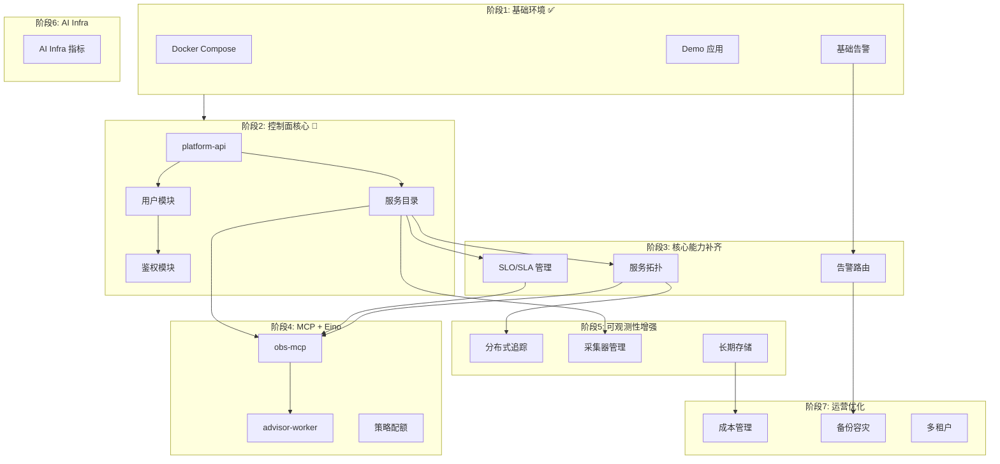

# 可观测平台 — 详细开发计划（本地优先）

本文与 [`观测性平台计划.md`](./观测性平台计划.md)、[`architecture.md`](./architecture.md)、[`工程量与工期.md`](./工程量与工期.md) 配套：**愿景与里程碑看前者，逻辑/数据流/完成顺序看中者，人日与排班看工程量文档，Compose 命令与端口看本文**。

---

## 1. 你现在需要在本地起哪些中间件？

| 组件 | 用途 | 本阶段是否必须 |
|------|------|----------------|
| **Prometheus** | 指标采集与告警规则计算 | **必须**（M1 基座） |
| **Grafana** | 看板与告警展示 | **必须** |
| **Loki** | 日志聚合 | **必须**（与结构化日志、runbook 联动） |
| **Promtail** | 把容器 stdout 打进 Loki | **必须**（compose 内与 Docker 集成最简单） |
| **MySQL** | 控制面元数据、审计、服务目录（M2+） | **建议现在就起**，便于后续 `platform-api` 直接连 |
| **Redis** | 限流、会话（计划中为可选） | **暂不强制** |
| **Alertmanager** | 告警路由（邮件/钉钉等） | **可选**；当前规则可先只在 Prometheus UI / Grafana 看 firing |
| **Alloy / OTel Collector** | 统一采集出口 | **下一阶段**再接；当前 demo 用 Prometheus 拉 `/metrics` 即可 |

**结论**：用仓库里的 Compose **一次起齐 Prometheus + Loki + Grafana + Promtail + Postgres + demo（checkout-sim）**；故障注入用 **独立镜像 + `compose run` 一次性任务**。

---

## 2. Docker Compose 一键环境

### 2.1 前置条件

- 已安装 **Docker Desktop**（Windows/macOS）或 Docker Engine（Linux）。
- **Linux 容器**模式；Promtail 需要挂载 **`/var/run/docker.sock`**（Windows/macOS 下由 Docker Desktop 提供，一般可直接用）。
- 在仓库**根目录**执行下文命令（保证 `context: ../..` 构建路径正确）。

### 2.2 启动观测栈 + demo

```bash
docker compose -f deploy/compose/docker-compose.yml up -d --build
```

### 2.3 访问入口

| 服务 | URL | 说明 |
|------|-----|------|
| Grafana | http://localhost:3000 | 默认账号 `admin` / `admin`（首次登录可改密） |
| Prometheus | http://localhost:9090 | Targets、Alerts、Graph |
| Loki | http://localhost:3100 | 一般由 Grafana 查询，可不直连 |
| checkout-sim | http://localhost:18080 | `/api/checkout`、`/metrics`、`/healthz` |
| PostgreSQL | `localhost:5432` | 用户 `obs` / 密码 `obs` / 库 `obs_platform` |

Grafana 已预置 **Prometheus、Loki** 数据源，并加载 **checkout-sim (demo)** 看板（Dashboards 中搜索 *checkout-sim*）。

### 2.4 生成业务流量（可选）

```bash
curl -s http://localhost:18080/api/checkout
# 或多次循环，便于图表与告警有数据
```

### 2.5 故障注入（独立容器，不常驻占资源）

`fault-injector` 使用 **profile `inject`**，**不会**随默认 `up -d` 启动，避免与 `docker compose run` 的容器名冲突。

**一键完整剧本**（约十几分钟，含等待时间）：

```bash
docker compose -f deploy/compose/docker-compose.yml --profile inject run --rm fault-injector /scripts/inject.sh demo
```

**单场景**：

```bash
docker compose -f deploy/compose/docker-compose.yml --profile inject run --rm fault-injector /scripts/inject.sh latency
docker compose -f deploy/compose/docker-compose.yml --profile inject run --rm fault-injector /scripts/inject.sh errors
docker compose -f deploy/compose/docker-compose.yml --profile inject run --rm fault-injector /scripts/inject.sh combo
```

**仅打流量**（不改 chaos 参数）：

```bash
docker compose -f deploy/compose/docker-compose.yml --profile inject run --rm fault-injector /scripts/inject.sh traffic 100
```

**手动清除 chaos**（本机可访问 18080 时）：

```bash
curl -sS -X POST http://localhost:18080/internal/chaos/reset -H "X-Chaos-Token: dev-chaos-token"
```

环境变量（注入容器内已默认）：`CHECKOUT_URL=http://checkout-sim:18080`、`CHAOS_TOKEN=dev-chaos-token`，与 `checkout-sim` 服务一致。

### 2.6 停止与清理

```bash
docker compose -f deploy/compose/docker-compose.yml down
# 同时删掉数据卷（Postgres/Grafana 持久化）：
docker compose -f deploy/compose/docker-compose.yml down -v
```

---

## 3. 告警与 Runbook（M1 验收用）

- 规则文件：`configs/prometheus-rules/checkout-sim.yml`（挂载进 Prometheus 容器）。
- 排障说明：`docs/runbooks/checkout-sim.md`。

**建议自测流程**：先 `up -d` → Grafana 确认 Prometheus target `checkout-sim` 为 UP → 执行 `inject.sh demo` → 在 Grafana 观察 RPS/延迟与 Loki 日志 → 在 Prometheus **Alerts** 页观察是否 firing（取决于等待时间与流量，可适当多打 `traffic`）。

---

## 4. 模块开发顺序（按依赖关系排序）

> 以下顺序基于模块间依赖关系和业务优先级排列，详见 [`observability-maturity.md`](./observability-maturity.md)

### 开发顺序总览

```
┌─────────────────────────────────────────────────────────────────────────────┐
│                           模块开发依赖关系                                   │
├─────────────────────────────────────────────────────────────────────────────┤
│                                                                             │
│  阶段1: 基础环境 ──────────────────────────────────────▶ 阶段2: 控制面核心  │
│  (M0-M1) ✅                                              (M2 前期) 🔄       │
│                                                                             │
│                                    ▼                                        │
│                                                                             │
│  阶段3: 核心能力补齐 ──────────────────────────────────▶ 阶段4: MCP + Eino  │
│  (M2.5) SLO/告警路由/服务拓扑                           (M3)               │
│                                                                             │
│                                    ▼                                        │
│                                                                             │
│  阶段5: 可观测性增强 ──────────────────────────────────▶ 阶段6: AI Infra    │
│  (M3.5) 分布式追踪/采集器/长期存储                       (M4)               │
│                                                                             │
│                                    ▼                                        │
│                                                                             │
│  阶段7: 运营与优化                                                          │
│  (M5+) 成本管理/备份容灾/多租户                                             │
│                                                                             │
└─────────────────────────────────────────────────────────────────────────────┘
```

---

### 阶段 1：基础环境（M0-M1）✅ 已完成

| 序号 | 模块 | 任务 | 完成标准 | 状态 |
|------|------|------|----------|------|
| 1.1 | 环境 | Compose 稳定启动 | 所有 URL 可访问，Prometheus 能 scrape `checkout-sim` | ✅ |
| 1.2 | 日志 | 结构化日志进 Loki | Explore 中用 `{compose_service="checkout-sim"}` 能查到 JSON 日志 | ✅ |
| 1.3 | 告警 | 告警规则可调通 | 注入后能在 UI 中看到相关告警或指标异常 | ✅ |
| 1.4 | 文档 | Runbook 可读 | 按 `checkout-sim.md` 能完成 reset | ✅ |

---

### 阶段 2：控制面核心（M2 前期）🔄 进行中

| 序号 | 模块 | 任务 | 完成标准 | 依赖 | 状态 |
|------|------|------|----------|------|------|
| 2.1 | platform-api | 连接数据库 | 健康检查 + 迁移工具 | 阶段1 | ✅ |
| 2.2 | user | 用户模块 | 注册、登录、API Key 管理 | 2.1 | ✅ |
| 2.3 | auth | 鉴权模块 | API Key + Casbin RBAC | 2.2 | ✅ |
| 2.4 | platform | 服务目录 API | CRUD + OpenAPI 片段 | 2.1 | 🔄 |
| 2.5 | 文档 | 标签与命名规范 | 写入 `docs/architecture.md` | - | 🔄 |

**当前进度**：用户模块、鉴权模块已完成，服务目录待完善

---

### 阶段 3：核心能力补齐（M2.5）⭐ 高优先级

| 序号 | 模块 | 任务 | 完成标准 | 依赖 | 优先级 |
|------|------|------|----------|------|--------|
| 3.1 | **slo** | SLO/SLA 管理 | 定义 SLO、错误预算计算、燃烧率告警 | 2.4 | ⭐⭐⭐ |
| 3.2 | **alerting** | 告警路由与通知 | Alertmanager 集成、多通道通知、升级策略 | 1.3 | ⭐⭐⭐ |
| 3.3 | **topology** | 服务拓扑 | 服务依赖图、调用关系可视化、影响分析 | 2.4 | ⭐⭐⭐ |
| 3.4 | alerting | 告警静默/抑制 | 维护窗口、告警聚合、静默规则 | 3.2 | ⭐⭐ |

**模块骨架**：已创建 ✅

**开发顺序建议**：
1. **alerting**（告警路由）→ 不依赖其他新模块，可立即开发
2. **slo**（SLO 管理）→ 依赖服务目录，需先完成 2.4
3. **topology**（服务拓扑）→ 依赖服务目录，需先完成 2.4

---

### 阶段 4：MCP + Eino（M3）

| 序号 | 模块 | 任务 | 完成标准 | 依赖 | 优先级 |
|------|------|------|----------|------|--------|
| 4.1 | mcp | obs-mcp 3～5 个只读工具 | 绑定 catalog + 限流 | 2.4, 3.1 | ⭐⭐⭐ |
| 4.2 | advisor | advisor-worker 最小 Eino 流程 | 输出引用预存查询 ID | 4.1, 3.1 | ⭐⭐⭐ |
| 4.3 | policy | 策略与配额 | 工具白名单、配额管理 | 4.1 | ⭐⭐ |
| 4.4 | test | 故障剧本 CI | 对 MCP/规则做固定 JSON 断言 | 4.1, 4.2 | ⭐⭐ |

**与阶段 3 的关系**：可部分并行，MCP 工具可先 mock SLO/拓扑接口

---

### 阶段 5：可观测性增强（M3.5）

| 序号 | 模块 | 任务 | 完成标准 | 依赖 | 优先级 |
|------|------|------|----------|------|--------|
| 5.1 | **trace** | 分布式追踪 | OpenTelemetry 集成、Tempo/Jaeger、Trace ID 关联 | 3.3 | ⭐⭐⭐ |
| 5.2 | agentcoord | 采集器管理 | Agent 配置版本下发、健康状态监控 | 2.4 | ⭐⭐ |
| 5.3 | integration | 长期存储 | VictoriaMetrics/Mimir 集成、数据降采样 | - | ⭐⭐ |
| 5.4 | trace | Trace 与日志关联 | trace_id 贯穿指标/日志/链路 | 5.1 | ⭐⭐ |

**模块骨架**：trace 已创建 ✅

**开发顺序建议**：
1. **trace**（分布式追踪）→ 依赖服务拓扑，需先完成 3.3
2. agentcoord（采集器管理）→ 依赖服务目录
3. integration（长期存储）→ 独立模块，可并行开发

---

### 阶段 6：AI Infra（M4）

| 序号 | 模块 | 任务 | 完成标准 | 依赖 | 优先级 |
|------|------|------|----------|------|--------|
| 6.1 | aiinfra | AI Infra 指标字典 | GPU/推理/训练指标定义 | 2.4 | ⭐⭐ |
| 6.2 | aiinfra | dcgm-exporter 集成 | GPU 指标采集 | 6.1 | ⭐⭐ |
| 6.3 | aiinfra | 推理服务指标 | vLLM/Triton 指标接入 | 6.1 | ⭐⭐ |
| 6.4 | aiinfra | AI Infra 面板 | Grafana 面板模板 | 6.1-6.3 | ⭐ |

**模块骨架**：aiinfra 已存在 ✅

---

### 阶段 7：运营与优化（M5+）

| 序号 | 模块 | 任务 | 完成标准 | 依赖 | 优先级 |
|------|------|------|----------|------|--------|
| 7.1 | **cost** | 成本管理 | 按服务/租户成本分摊、基数治理、优化建议 | 5.3 | ⭐⭐ |
| 7.2 | storage | 备份与容灾 | 定期备份、恢复演练、高可用部署 | - | ⭐⭐⭐ |
| 7.3 | platform | 多租户完善 | 数据隔离、资源配额、计费预留 | 2.4 | ⭐⭐ |
| 7.4 | alerting | On-call 集成 | PagerDuty/值班表、轮换策略、升级流程 | 3.2 | ⭐⭐ |

**模块骨架**：cost 已创建 ✅

---

## 5. 模块依赖关系图



---

## 6. 新增模块详细设计

### 6.1 SLO/SLA 管理模块（internal/slo）

```
internal/slo/
├── domain/
│   ├── objective.go          # SLO 定义（目标、时间窗口）
│   ├── error_budget.go       # 错误预算计算
│   ├── burn_rate.go          # 燃烧率告警
│   └── sli.go                # SLI 指标定义
├── application/
│   ├── service.go            # SLO 计算服务
│   └── calculator.go         # 预算计算器
├── infrastructure/
│   └── prometheus.go         # 从 Prometheus 获取 SLI 数据
└── interfaces/http/
    ├── handler.go
    └── routes.go
```

**核心概念**：
- **SLI**（服务水平指标）：可用性、延迟、错误率
- **SLO**（服务水平目标）：99.9% 可用性
- **错误预算**：允许的故障额度
- **燃烧率**：错误预算消耗速度

**API 设计**：
```
POST   /api/v1/slos                    # 创建 SLO
GET    /api/v1/slos                    # 列出 SLO
GET    /api/v1/slos/:id                # 获取详情
GET    /api/v1/slos/:id/status         # 当前状态（错误预算、燃烧率）
GET    /api/v1/slos/:id/report         # SLO 报告
```

### 6.2 告警路由模块（internal/alerting）

```
internal/alerting/
├── domain/
│   ├── routing.go            # 告警路由规则
│   ├── silencing.go          # 静默规则
│   ├── escalation.go         # 升级策略
│   ├── alert.go              # 告警实体
│   └── receiver.go           # 接收者
├── application/
│   └── service.go            # 告警服务
├── infrastructure/
│   ├── alertmanager.go       # Alertmanager 客户端
│   ├── dingtalk.go           # 钉钉通知
│   ├── slack.go              # Slack 通知
│   ├── email.go              # 邮件通知
│   └── pagerduty.go          # PagerDuty 通知
└── interfaces/http/
    ├── handler.go
    └── routes.go
```

**功能**：
- 多通道通知（钉钉、Slack、邮件、PagerDuty）
- 告警路由（按服务/严重程度/租户）
- 静默规则（维护窗口）
- 升级策略（未响应自动升级）

### 6.3 服务拓扑模块（internal/topology）

```
internal/topology/
├── domain/
│   ├── service_graph.go      # 服务依赖图
│   ├── edge.go               # 调用关系
│   ├── node.go               # 服务节点
│   └── impact.go             # 影响分析
├── application/
│   └── service.go            # 拓扑计算服务
├── infrastructure/
│   ├── trace_analyzer.go     # 从 Trace 提取依赖
│   └── metric_analyzer.go    # 从指标提取依赖
└── interfaces/http/
    ├── handler.go
    └── routes.go
```

**功能**：
- 服务依赖关系可视化
- 调用链路追踪
- 故障影响范围分析
- 变更风险评估

### 6.4 分布式追踪模块（internal/trace）

```
internal/trace/
├── domain/
│   ├── span.go               # Span 定义
│   ├── trace.go              # Trace 定义
│   └── service_dependency.go # 服务依赖
├── application/
│   └── service.go            # Trace 服务
├── infrastructure/
│   ├── otlp_receiver.go      # OTLP 接收器
│   ├── tempo_client.go       # Tempo 客户端
│   └── jaeger_client.go      # Jaeger 客户端
└── interfaces/http/
    ├── handler.go
    └── routes.go
```

**功能**：
- OpenTelemetry 协议支持
- Trace ID 贯穿三大支柱
- 服务依赖自动发现
- 性能瓶颈定位

### 6.5 成本管理模块（internal/cost）

```
internal/cost/
├── domain/
│   ├── allocation.go         # 成本分摊
│   ├── optimization.go       # 优化建议
│   ├── cardinality.go        # 基数分析
│   └── report.go             # 成本报告
├── application/
│   └── service.go            # 成本服务
├── infrastructure/
│   ├── prometheus.go         # 指标基数分析
│   ├── loki.go               # 日志量分析
│   └── victoriametrics.go    # VM 分析器
└── interfaces/http/
    ├── handler.go
    └── routes.go
```

**功能**：
- 按服务/租户成本分摊
- 指标基数治理
- 存储优化建议
- 成本趋势分析

---

## 7. 中间件扩展计划

### 7.1 新增中间件

| 组件 | 用途 | 阶段 | 说明 |
|------|------|------|------|
| **Tempo** | 分布式追踪存储 | 5.1 | 与 Loki/Prometheus 统一标签 |
| **Alertmanager** | 告警路由 | 3.2 | 多通道通知 |
| **VictoriaMetrics** | 长期存储 | 5.3 | 替代或补充 Prometheus |
| **Redis** | 限流/会话 | 4.3 | 可选，支持降级 |

### 7.2 Docker Compose 扩展

```yaml
# deploy/compose/docker-compose-extended.yml
services:
  tempo:
    image: grafana/tempo:latest
    ports:
      - "3200:3200"   # HTTP
      - "4317:4317"   # OTLP gRPC
      - "4318:4318"   # OTLP HTTP
    volumes:
      - ./configs/tempo:/etc/tempo
    networks:
      - obs

  alertmanager:
    image: prom/alertmanager:latest
    ports:
      - "9093:9093"
    volumes:
      - ./configs/alertmanager:/etc/alertmanager
    networks:
      - obs

  victoriametrics:
    image: victoriametrics/victoria-metrics:latest
    ports:
      - "8428:8428"
    volumes:
      - vmdata:/storage
    networks:
      - obs
```

---

## 8. 常见问题

1. **Promtail 无日志**：确认 Docker.sock 挂载成功；在 Linux 上需将用户加入 `docker` 组。查询标签先试 `{container=~".*checkout.*"}` 再对照 `compose_service`。  
2. **告警不 firing**：样本不足或 `for` 未到；多拉 `/api/checkout` 或缩短规则中的 `for` 做本地实验（勿直接提交过松规则）。  
3. **构建失败 go 版本**：`demo-apps/checkout-sim/Dockerfile` 使用 `GOTOOLCHAIN=auto`，与根目录 `go.mod` 的 `go` 版本声明一致即可。  
4. **`docker compose run fault-injector` 报 container name 冲突**：请使用 **`--profile inject`**，且不要给 `fault-injector` 写死与 run 冲突的 `container_name`（当前 compose 已按此方式配置）。

---

## 9. 下一步建议

### 当前应优先完成

1. **阶段 2.4**：完善服务目录 API（其他模块依赖）
2. **阶段 3.2**：告警路由模块（无额外依赖，可立即开发）
3. **阶段 3.1**：SLO 管理（依赖服务目录）

### 本周可执行

1. 跑通 **2.2 + 2.5** 全流程并截屏/笔记（作为 M1 验收草稿）。  
2. 对照 [`architecture.md`](./architecture.md) 核对数据流与**完成顺序**；有变更时同步修订本文端口/服务表。  
3. 为 `platform-api` 增加 **MySQL ping** 与 **配置化 DSN**（`DATABASE_URL`），在 Compose 里加 `depends_on: mysql` 的侧车或后续再挂同一网络。

---

*文档版本：与 `deploy/compose/docker-compose.yml` 同步维护；若改端口或 profile 名，请同时改本节命令。*

**修订记录**：

| 日期 | 变更 |
|------|------|
| 2026-04-06 | 重置文档，按依赖关系重新排序模块开发顺序 |
