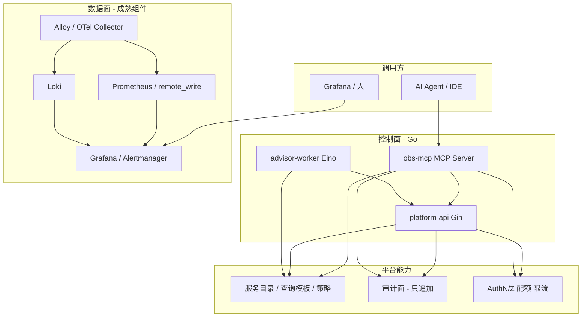

下面是一份面向**长期个人项目**的「架构方案 + 主要构成 + 代码结构 + 工作计划」说明，可直接当 **README / 设计总览**；技术选型偏**成熟、可演进**，**不自研采集内核**；在 AI 时代通过 **MCP 治理、审计面、可评测 Agent（Eino）** 形成与主流「大而全 SaaS」的差异化叙事。

---

## 一、项目定位（三阶段不变，语义补强）

- **阶段①**：可运维、可扩展的观测基座（指标 / 日志 / 可选链路 / 告警 / 多环境），并明确 **控制面高可用与 RPO/RTO** 的渐进目标。  
- **阶段②**：**控制面 + 采集协同 + MCP 工具面 + 基于平台事实的可评测 Agent**（注册、配置版本、心跳、只读聚合、**Eino** 编排的建议能力）。  
- **阶段③**：**AI Infra 观测**（GPU / 队列 / 推理与批任务指标字典与面板规范），与 **AI 操作审计、高危行为规则检测** 同一套服务目录与标签规范。

**与主流平台的差异（一句话）**：在标准 **Prometheus / Loki / Grafana** 数据面上，叠加 **服务目录为单一真相源**、**带边界的 MCP**、**可追加审计** 与 **故障剧本回归**，而不是再做一个通用时序库或聊天框。

---

## 二、总体架构（逻辑分层）



**分层说明**

| 层级 | 职责 | 原则 |
|------|------|------|
| **数据面** | 采集、存储、查询、告警 firing | 尽量开源成品；预留 `remote_write`、标签规范与基数门禁。 |
| **控制面** | 租户/注册、配置版本、服务目录、API Key、mTLS、只读聚合 API | **无状态多副本**；状态进 **PostgreSQL**。 |
| **智能层** | 规则 + 可选 LLM：归纳、步骤建议 | **Eino** 编排工具调用；输出必须可映射到**目录中的查询/告警 ID**。 |
| **MCP 工具面** | 对外暴露**有限、可治理**的能力（列表服务、告警上下文、预存查询、runbook 元数据等） | **白名单工具 + schema + 结果截断**；不默认开放任意 PromQL。 |
| **审计面** | 记录「谁通过 API/MCP 做了什么」（主体、租户、工具名、参数摘要哈希、结果条数、允许/拒绝原因） | **只追加**、保留策略严于业务日志；用于 AI 高危行为与合规取证。 |

**可选并行（不绑主线验收）**

- **eBPF**：仅在出现明确内核/网络盲区或运行时安全叙事时做 spike；**M1 不做硬性要求**。  
- **Cilium/Hubble、服务网格**：与主路线并行学习，不进入 M0～M1 验收。

---

## 三、主要构成

### 1. 语言与后端框架（控制面 / 平台 API）

| 用途 | 选型 | 说明 |
|------|------|------|
| 主语言 | **Go 1.25** | 控制面、Worker、MCP 服务统一栈，依赖与观测一致。 |
| HTTP API | **Gin** | 已选定；生态广、中间件丰富。中间件：**鉴权、限流、request id、zap**。 |
| 配置 | **Viper** | 十二因子；本地与容器一致。 |
| 日志 | **zap** | 结构化；与 trace id 对齐。 |
| 数据库访问 | **GORM + MySQL** | 已选定；迁移文件位于 `internal/storage/migrations/mysql/`。 |

### 2. Agent / 建议编排（阶段②③）

| 用途 | 选型 | 说明 |
|------|------|------|
| LLM 应用与工具编排 | **CloudWeGo Eino**（`github.com/cloudwego/eino`） | 字节生态下 Go 原生 **Agent/工作流/工具** 组合；与当前栈同语言，便于与 `platform-api`、MCP 共用模型与客户端。 |
| 工具契约 | **JSON Schema** 校验 + 平台侧 **allowlist** | 工具入参出参校验；与 MCP 暴露面一致时可复用同一套 schema 定义。 |
| LLM 后端 | **OpenAI 兼容 API** / **Ollama** / **vLLM** | 与 Eino 的 model 适配层解耦，便于切换。 |
| 评测与回归 | **故障剧本 + 期望结构（JSON）** + CI 打分 | 覆盖「人读建议」与 **MCP/Eino 工具调用序列**（是否越权、是否乱查）。 |

**采集侧说明（避免混淆）**：业务指标/日志采集仍以 **Grafana Alloy** 或 **OpenTelemetry Collector** 为主；`cmd/agent` 若存在，仅作 **bootstrap / 配置拉取 / 健康检查** 薄壳即可。

### 3. MCP 与 AI 安全（阶段②起逐步落地）

| 用途 | 选型 | 说明 |
|------|------|------|
| 对外工具协议 | **MCP（Model Context Protocol）** | 独立进程 **`obs-mcp`**（或合并进 `platform-api` 的 `/mcp` 子路由，ADR 中二选一）。 |
| 高危行为与异常模式 | **规则优先**（速率、新工具、跨租户、结果体量突增）+ 审计查询 | 深度语义检测不替代 WAF；平台聚焦**可观测、可告警、可取证**。 |
| 漏洞类信号 | **集成扫描结果**（如镜像/依赖 CVE）作为事件与时间线 | 平台负责**关联服务目录与展示**；扫描引擎不自研。 |

### 4. 观测数据面（尽量用成品，不自研采集协议）

| 能力 | 选型 | 说明 |
|------|------|------|
| 指标存储与查询 | **Prometheus** → **Mimir** 或 **VictoriaMetrics** | 早定 **`remote_write`** 与 `cluster`/`env` 标签；关注基数与成本。 |
| 日志 | **Grafana Loki** | 与指标标签模型对齐。 |
| 采集 / Agent 内核 | **Grafana Alloy** 或 **OpenTelemetry Collector** | 配置由平台版本化下发；不重写 exporter。 |
| 可视化与告警 | **Grafana** + **Alertmanager** 或 Grafana Alerting | 告警规则即代码；runbook 链接进平台目录。 |
| 分布式追踪（可选） | **OpenTelemetry** → **Grafana Tempo** | 与日志 trace id 关联。 |
| K8s 标准栈 | **kube-prometheus-stack** | ServiceMonitor、告警规则 Git 管理。 |

### 5. 平台侧中间件与存储

| 用途 | 选型 | 说明 |
|------|------|------|
| 元数据与控制面 | **MySQL** | 注册、租户、配置版本、服务目录、API Key、审计条目索引。 |
| 缓存 / 速率限制 | **Redis**（可选） | 限流、短期会话；**需可降级路径**（Redis 短时不可用仍可读核心元数据）。 |
| 对象存储（可选） | **MinIO** | 冷数据、导出、备份。 |
| 消息队列（可选） | **NATS** 或 **Redis Stream** | 配置变更通知、异步建议任务。 |

### 6. 高可用（观测平台自身）

| 组件 | 建议 |
|------|------|
| **platform-api / obs-mcp / advisor-worker** | 无状态水平扩展；健康检查与优雅退出。 |
| **MySQL** | 按环境选择托管或主从；备份与恢复演练写入 M5。 |
| **Prometheus** | 双副本或分片 + remote_write 到 Mimir/VM；避免单点与长期本地盘风险。 |
| **Alertmanager** | 集群模式（生产）；与 Grafana 告警二选一策略写 ADR。 |
| **Grafana** | HA 或托管；个人阶段可单实例但文档标明 RTO。 |

### 7. 容器与编排、AI Infra、工程质量

| 分类 | 选型 |
|------|------|
| 本地一体化 | **Docker Compose**（MVP） |
| 集群 | **kind** / **minikube** / **k3s** |
| 部署 | **Helm**（观测栈 + 自研 chart） |
| GitOps（可选） | **Argo CD** |
| AI Infra（阶段③） | **dcgm-exporter**；**vLLM** / **Triton** 等样例；批任务 **Volcano** 或 Job/CronJob |
| CI / 契约 / 密钥 | **GitHub Actions** / **GitLab CI**；**OpenAPI**；**SOPS** / 环境变量 |

---

## 四、推荐代码仓库结构（Monorepo）

```text
obs-platform/
├── README.md
├── docs/
│   ├── architecture.md                # 分层架构、数据流、完成顺序
│   ├── 开发计划.md                    # Compose、端口、故障注入、阶段任务
│   ├── 工程量与工期.md                # 人日预估、排班、风险与砍 scope
│   ├── observability-design.md        # 按服务：信号-告警-runbook
│   ├── mcp-tools.md                   # MCP 工具列表、权限与 schema（可选）
│   ├── runbooks/
│   └── adr/
├── deploy/
│   ├── compose/
│   ├── helm/
│   │   ├── obs-stack/
│   │   └── obs-platform/              # platform-api、obs-mcp、worker
│   └── alloy/
├── api/
│   └── openapi/                       # platform-api OpenAPI
├── cmd/
│   ├── platform-api/                  # Gin 控制面 HTTP API
│   ├── obs-mcp/                       # MCP Server（可与 platform-api 合并，ADR 决策）
│   ├── advisor-worker/                # Eino 编排：建议生成、工具调用
│   ├── agent/                         # 可选：采集侧薄壳 bootstrap
│   └── worker/                        # 可选：异步聚合、通知
├── internal/
│   ├── platform/                      # 注册、租户、服务目录、配置版本
│   ├── agentcoord/                    # 心跳、下发、指令
│   ├── integration/                   # Mimir / Loki / Grafana 客户端
│   ├── mcp/                           # MCP 工具实现、注册、与 auth 绑定
│   ├── advisor/                       # Eino graph、prompt、规则引擎入口
│   ├── audit/                         # 审计写入、查询（只读 API）
│   ├── policy/                        # 工具白名单、配额、参数校验
│   ├── aiinfra/                       # 阶段③：指标字典与约定
│   ├── auth/
│   └── storage/                       # sqlc / repository
├── pkg/
│   ├── model/
│   └── version/
├── test/
│   ├── integration/
│   └── e2e/                           # 故障剧本 + 可选 MCP/Eino 调用回归
├── demo-apps/
│   └── checkout-sim/
├── configs/
│   └── prometheus-rules/
└── Makefile
```

---

## 五、工作计划（里程碑）

### M0：仓库与规范（约 1～2 周）

- Monorepo、`Makefile`、Compose 起 Grafana + Prometheus + Loki + MySQL。  
- **Gin** 已选定；`platform-api` 骨架 + 健康检查。  
- 标签规范（`env`、`service`、`tenant`、`cluster`）；`docs/architecture.md` 含分层简图与 **HA 目标占位**。

### M1：基座「可回答排障问题」（约 4～8 周）

- **demo-apps** + 注入故障脚本；RED + 结构化日志 + request/trace id。  
- Grafana overview + drill-down；**2～3 条高质量告警** + runbook。  
- 可选：OTel → Tempo。

**验收**：15 分钟内仅靠平台定位一次注入故障。

### M2：控制面 + 采集协同 + 服务目录（约 6～12 周）

- 注册、mTLS 或 token、**配置版本下发**、Alloy 配置渲染来源。  
- **服务目录**：服务 ↔ Prom/Loki **预存查询模板**、告警元数据（机器可读）。  
- **审计表**：API 写路径先记录关键操作（配置发布、密钥轮换类）。

**验收**：新环境 10 分钟内纳入同一套查询与告警语义。

### M3：MCP + Eino 建议 + 可评测（约 6～10 周，可与 M2 尾部重叠）

- **obs-mcp**：优先 **3～5 个只读工具**（列表服务、告警上下文、执行预存查询、runbook 元数据等），**限流 + 结果截断**。  
- **advisor-worker**：**Eino** 编排；规则优先，LLM 可选；输出须**引用目录中的查询/告警 ID**。  
- **CI**：故障剧本 + JSON 期望；可选对 **MCP 工具调用序列**做断言。  
- **policy**：工具白名单与 JSON Schema 与 MCP/advisor 共用。

**验收**：5 个剧本下「可验证步骤」正确率可量化；审计可还原一次完整 MCP 会话。

### M4：AI Infra 观测（持续，M2 后可预热文档）

- dcgm-exporter、推理队列/自定义指标、**指标字典**与面板模板。  
- AI 工作负载纳入**同一目录与标签规范**；注意 **基数与分层 SLI**（调度 / 节点 / 框架 / 服务）。

**验收**：一次 GPU 或排队问题能区分算力 / 调度 / 应用层瓶颈。

### M5：硬化（贯穿，后期加重）

- Compose/集成测试、配置漂移检测、**备份恢复演练**；多租户配额预留。  
- **AI 审计**：高危规则（异常工具、跨租户尝试、体量突增）告警到 Grafana。  
- eBPF / 网格等仅在有 ADR 与明确场景时纳入。

---

## 六、长期习惯

- 重大选型写 **ADR**（含：**不做什么**）。  
- 架构图与 `observability-design.md` 随里程碑更新。  
- **故障剧本库**同时服务：人、Eino、MCP 评测。

---

## 七、小结

| 维度 | 内容 |
|------|------|
| **架构** | 数据面（Prom/Loki/Grafana/Alloy）+ 控制面（Gin）+ **MCP 工具面** + **Eino 智能层** + **审计面**；服务目录为枢纽。 |
| **差异化** | 治理与可证明（审计、白名单、剧本回归），而非自研时序库或单一聊天 UI。 |
| **Agent** | 采集用 Alloy/OTel；**编排与建议用 Eino**；可选薄壳 `cmd/agent`。 |
| **路径** | M0 → M1 可排障 → M2 目录与配置 → **M3 MCP + Eino + 评测** → M4 AI Infra → M5 硬化。 |

若你希望下一步更可执行，可在 **M3** 内先定稿 **「首发的 3～5 个 MCP 工具名称与入参出参 schema」**，再落到 OpenAPI / `docs/mcp-tools.md` 与实现顺序。

**架构与数据流**：见 [`architecture.md`](./architecture.md)。**本地环境与命令**：见 [`开发计划.md`](./开发计划.md)（Docker Compose、中间件清单、故障注入）。
